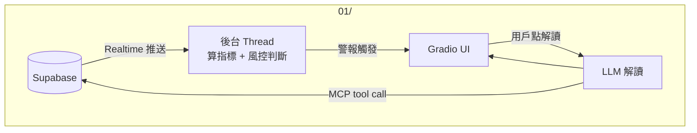

# Architecture — 01 短線監控系統

## 核心價值
盤中自動監控股票指標，觸發警報後用戶可按需觸發 LLM 解讀當下狀況。

## 使用情境
```
用戶設定股票代號 + 指標 + 閾值
    ↓
訂閱 Supabase Realtime（03/ Worker 寫入時自動推送）
    ↓
收到新資料 → 算指標 → 風控判斷
    ↓
觸發條件成立 → UI 顯示警報（No LLM）
    ↓
用戶點「解讀」→ 觸發 LLM 解讀當下狀況
```

## 架構圖



## 各層說明

| 層 | 職責 | 技術 |
|---|---|---|
| Supabase Realtime | 有新資料時推送給後台 Thread | supabase-py Realtime |
| 後台 Thread | 收到資料 → 算指標 → 風控判斷 → 更新警報狀態 | Python threading |
| 分析層 | 計算 MA / RSI / MACD | pandas-ta |
| 風控層 | rule-based 閾值判斷，觸發警報 | Python |
| Gradio UI | 顯示警報 + 觸發 LLM 解讀 | gradio |
| LLM 解讀 | 用戶點擊後按需觸發，解讀當前指標狀況 | MCP + Claude API |

## 風控指標設計

| 指標 | 觸發條件（預設）| 用戶可調整 |
|---|---|---|
| RSI | > 80 超買 / < 20 超賣 | 是 |
| MA | 價格跌破 20MA | 是 |
| MACD | 死叉出現 | 是 |

## Gradio UI 佈局

```
┌─────────────────────────────────────┐
│  股票代號：[2330]                    │
│  監控指標：[✓MA] [✓RSI] [✓MACD]    │
│  RSI 閾值：[80] / [20]              │
│  [開始監聽]  [停止]                  │
├─────────────────────────────────────┤
│  狀態：監聽中...                     │
│  ⚠️ RSI 超過 80（14:32）[解讀]      │
│  ⚠️ MACD 死叉（14:35）  [解讀]      │
├─────────────────────────────────────┤
│  [解讀結果顯示區]                    │
│  「目前 RSI 82，結合 MACD 死叉...」 │
└─────────────────────────────────────┘
```

## MCP Tools

- `get_latest_data(symbol)` — 從 Supabase 讀最新一筆資料
- `get_indicators(symbol)` — 取得當前指標數值
- `get_alerts_history(symbol)` — 取得最近警報紀錄

## 邊界設計

- 警報觸發是 rule-based，No LLM
- LLM 只在用戶點擊「解讀」後才觸發（按需，不自動）
- LLM 只解讀指標，不給買/賣建議
- LLM 回答時標注依據的指標與數值
